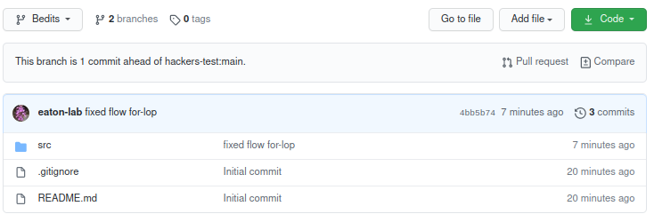
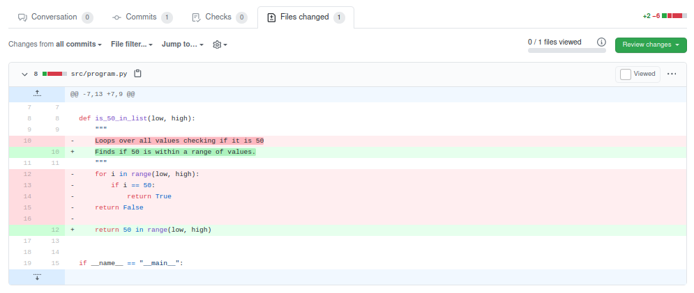

<style>
h2 {
    margin-top: 30px;
}
h3 {
    margin-top: 30px;
}
pre {
    line-height: 1.25em;
}
pre code {
    font-size: 0.9em;
}
</style>


## Collaborative coding with git


**Table of Contents:**
* Table of contents
{:toc}


### Why collaborate code?

Collaborative coding is an efficient way to write better and faster code. 
By bouncing ideas off of others you can often find better ways to design and
implement code to achieve your goals. Everyone's style is different, and most
coding problems can be solved in numerous possible ways. By working with 
others you will be exposed to new problems and routines that you may wish
to include in your own code in the future. 

Collaborative coding is easier today than it has ever been before, thanks to
public code repositories like GitHub, which leverage `git` to sync code 
between local and cloud-based repositories, and to resolve conflicts that
can arise when multiple users are editing code at the same time. So far 
we have learned to use these tools as an individual user, where conflicts
are very uncommon. Now we will begin to implement collaborative coding where
you will likely encounter conflicts, so we will need to learn how to resolve
them. 


## Example workflow

- User A has a repo hosted on GitHub.
- User B *forks* the repo, commits changes, and pushes to their fork.
- User B opens a *pull request* from GitHub telling User A about the new changes.
- User A looks at the pull request on GitHub to understand the changes.
	- If the changes are very simple:
		- User A accepts the request to merge commits into their code, closing the request.
	- If the changes are complex, or include a conflict:
        - User A can resolve the conflict in GitHub's editor.
        - Or, User A can *check out* User B's pull request as a new branch.
		  - User A resolves conflicts in their editor, or makes changes to the new code.
          - User A then merges this branch into main and push commits to origin.
		  - User A goes back to the pull request on GitHub, which is now identical to main, and closes it.


### User A has a repo hosted on GitHub
User A created a new repo at `https://github.com/UserA/collab-test` as a
simple Python package. 

### User B forks the repo, commits changes, and pushes to their fork
User A is collaborating with User B, who is a better coder, and is going to 
check in on User A's project occasionally to make edits to improve it. 

User B creates a *fork* of User A's repo and clones it to their computer.
User B can then make their changes to the main branch or to a new named branch,
it doesn't really matter. For clarity, we'll use a new branch here called 
`Bedits`.

```bash
# user B clone's their forked repo and cd into it
git clone https://github.com/UserB/collab-test
cd collab-test/

# creates a new branch for their edits
git checkout -b Bedits

# makes changes to the code
# subl .
```

In this case User B saw that User A had written the function below to check
whether the number 50 is within a range between two numbers:
```python
def is_50_in_list(low, high):
    """
    Loops over all values checking if it is 50
    """
    for i in range(low, high):
        if i == 50:
            return True
    return False
```
and they realized that this could be written much more efficiently as the 
following, and so they made a change to the code:
```python
def is_50_in_list(low, high):
    """
    Finds if the value 50 is within a range of numbers.
    """
    return 50 in range(low, high)
```

User B then stages and commits this change and pushes to their fork (origin).
They could push to main or to a separate branch name, here we will push to the
branch name Bedits. 

```bash
# stages, commits and pushes new branch to forked repo
git add .
git commit -m "fixed slow for-loop"
git push origin Bedits
```

### User B opens a pull request
User B now makes a pull request to User A on GitHub to make them 
aware that there are new changes to the code. To do this they go to their
own forked repo and click on the Pull request button. Here you can see that
GitHub is alerting User B that their branch is ahead of User A



In the pull request User B can enter additional comments to describe the 
commits on this new branch. Then they click the green 
"Create pull request" button to officially send it.


### User A looks at the pull request on GitHub
User A will receive an email alerting them to the pull request, 
and it will appear in the pull request tab on their repo page, like below:


User A can now investigate these *proposed* changes. They need to figure out
if it is a very simple change or a complex one. This will affect their decision
of how to deal with the pull request.

User A knows that User B is a much better coder, and so they are likely to 
accept the changes, but still, User A wants to be sure that the new code makes 
sense before accepting (merging) the commits into their project. After all, 
this is User A's project, and they have the final say about how the code 
should be written.

The first thing User A can do is to click on the Pull Request tab 
which will show whether or not the changes conflict with any other changes 
that User A has made to their code. They can then click on the tab labeled 
"Files changed" to see a *diff* of the changes made by User B. This shows 
line-by-line which lines were removed or added by User B. Example below:




### If the changes are simple
If the changes to the code are simple, as in the example here, the User 
can go back to the first tab (conversation) of the Pull Request and select 
"Merge pull request" to accept the changes. These commits will be merged
into `origin/main`. 


### If the changes are complex or conflicting
Although User A trusts User B, the changes they proposed may seem wonky, and
so User A wants to test run the code before merging into their main branch.
They can do this by *checking out* the commits that User B proposed onto 
a new branch. This can be done following the convention below:

```bash
# template for checking out a pull request
git fetch origin pull/ID/head:BRANCHNAME
```

where ID is replaced by the number that is listed next to the title of the 
pull request on GitHub. In this case it was 1, since this was the first pull
request. In addition, BRANCHNAME should be replaced by the name that UserA
*wants* to call this branch. I will call it UserB to indicate that it came 
from them.

```bash
# checking out pull request #1 as branch UserB
git fetch origin pull/1/head:UserB
```
<pre style="background-color: lightgrey; padding:10px"><code>
remote: Enumerating objects: 7, done.
remote: Counting objects: 100% (7/7), done.
remote: Compressing objects: 100% (2/2), done.
remote: Total 4 (delta 2), reused 4 (delta 2), pack-reused 0
Unpacking objects: 100% (4/4), 414 bytes | 207.00 KiB/s, done.
From https://github.com/hackers-test/collab-test
 * [new ref]         refs/pull/1/head -> UserB
(base) deren@tuba:~/hacks/collab-test (main)$ 
</code></pre>


User A can now check out this branch to test the new code.
```bash
# checkout the new branch
git checkout -b UserB

# the new commits are now enacted in your code, view and test the
# code in your favorite text editor.
subl .
```

Once User A has tested the code and is satisfied that the changes UserB made 
are fine, they can merge these changes into their main branch.

```bash
# switch back to the main branch
git checkout main

# merge changes from UserB branch into main
git merge UserB

# remove the UserB branch that is no longer needed
git branch -d UserB

# push to origin main
git push origin main
```


### Syncing local and remote
If you accept a pull request directly on GitHub (the remote), and then later
try to push some new changes to the same repo from your command line (local),
git will tell you that your local branch is behind the remote branch, and 
that you need to perform a `git pull`. Go ahead and do this to update your
current branch, then rety your `git push` command.


### In case of conflicts
Let's consider an example of a conflict. Imagine that User A accepted User B's
changes directly on GitHub, but they also made a similar change to the code 
on their own branch locally. If they try to do a `git pull` they will encounter
a conflict, where the local file includes changes to the same lines that changed
in the file on the remote. There are several ways to resolve this, depending
on who's version of the result you want to keep. This is the topic of the 
next tutorial.

