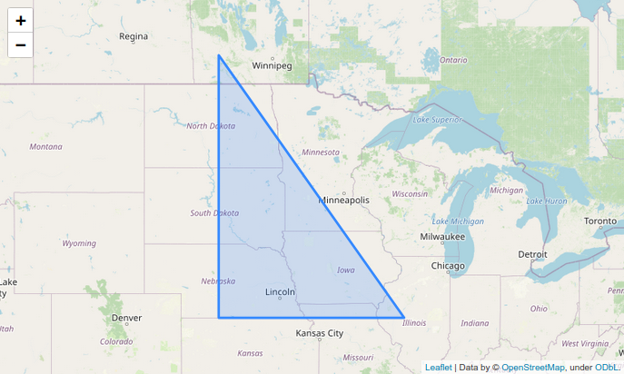
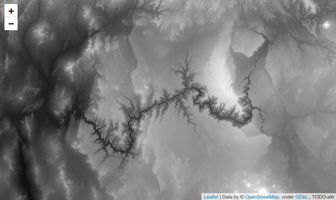
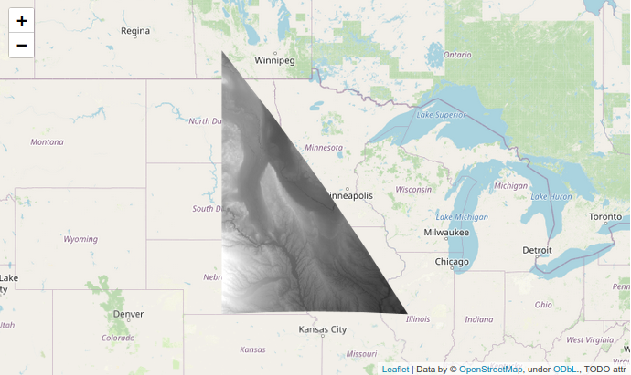
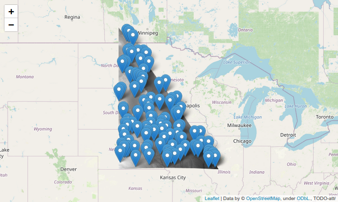
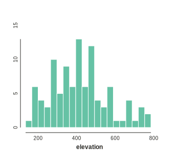

<style>
h2 {
    margin-top: 30px;
}
h3 {
    margin-top: 30px;
}
pre {
    line-height: 1.1em;
}
pre code {
    font-size: 0.9em;
}
#example {
  height: 500px;
  display: block;
  margin: auto;
}
.pngmap {
    display: block; 
    margin: auto; 
    width: 100%; 
    margin-top:2%;
}
</style>


# Raster analysis in Google earth engine 

In this tutorial you will be introduced to the raster image visualization and
analysis in the context of geospatial analyses using the Google Earth Engine
REST API. Rasters are bitmap images, with values assigned to grid cells that 
can be overlaid on a map. So far we have examined pre-existing rasters as 
tilesets on maps that are fetched from a REST API to visualize a baselayer
containing information like land cover, roads, borders, etc. These base layers
are often used as a background on which vector data is plotted on top as the 
true focus of analyses (e.g., points or polygons). However, raster data itself
can serve as an incredibly rich source of information not only for producing
vector information, but also for representing variation in measured variables
using raster visualizations.

In fact, raster visualization has spurred an entire field of geospatial analyses
around the concept of *remote sensing* data. This involves analyses of global
datasets that typically use satellite images composing measurements over multiple
spectra, which provides reflectance data informative about climate and land cover.
Because these images are repeated on uniform cycles time-series analyses of these
images can further provide measurement of changes over time in weather, climate,
and land-use. For these reasons remote-sensing data has become a central part
of conservation and biodiversity science. The data available from the largest
remote-sensing datasets is truly incredible. Check out the descriptions of the
LandSat, MODIS, and Sentinel datasets [here](https://developers.google.com/earth-engine/datasets/catalog/landsat). 

The image below is a beautiful example, showing a series of images that are 
joined to create a GIF movie. In these images a raster layer is used to show
temperate values as a linear colormap (blue to green to yellow to red), 
and this is projected with a low opacity over another layer showing 
elevation/topography. Together, the image clearly show the 
insolating effect of mountains versus lowland in temperature fluctuations
over some amount of time. This example comes from the Google Earth Engine
documentation, which we will soon explore.


<div style="background-color: black">
    
</div>

## Sign up for earthengine
To get started using Google earthengine you will need to first signup 
with a gmail account. Your University account is probably best to use, since 
you can likely take advantage of extra free storage space.
[https://signup.earthengine.google.com/](https://signup.earthengine.google.com/).
The approval process was nearly instant when I tested recently.


## What is Google earthengine
Google earthengine (abbreviated `ee` here) is a REST API service provided 
by Google that allows you to make *programmatic requests* to their servers 
to access data and cloud-based computing functions to operate on data. The 
final result will be a REST API URL for a vector or raster dataset that can
be fetched and visualized on a map, like with folium.

The instructions for creating the particular dataset you want to access 
are sent from you to Google in JSON format, and has a fairly complicated 
structure. Therefore, Google developed two programmatic APIs for building 
and sending the JSON requests, based on instructions that you can write in 
JavaScript or Python code. The JavaScript version is the default, and is 
much better documented. The Python API can do pretty much everything the JS 
version does, but figuring out how to translate from one set of instructions
to the other takes some practice. Fortunately, you're all Pythonistas 
by now, and should be able to figure it out. 

We'll discuss some of these differences, starting with the first major one, 
which is that in Python we will need to use the `folium` library to visualize
maps, rather than the JavaScript Map object. Thus, this tutorial will build 
off of our last tutorials that introduced `folium`.


## Getting the earthengine Python API
As usual, you can install the package from conda-forge. 

```bash
conda install -c conda-forge earthengine-api
```


## Why use earthengine?

#### The data
Google hosts a huge number of large and complex datasets. This includes
both raster images and vector data. The raster data is often in the form
of `ImageCollection` objects, which represent series of images such as time
series. You can search these datasets in the [earthengine data catalog](https://developers.google.com/earth-engine/datasets). These datasets are 
very interesting to analyze on their own, but they can also be treated
as raw data (measurements in cells) and combined in creative ways using 
mathematical and statistical operations, to generate new raster layers 
representing new values. This ability to combine and analyze existing large
datasets to create new measurements is really the bread and butter of 
remote sensing analyses. 

#### The workflow
Working with such enormous image data collections can be extremely cumbersome.
Just the process of downloading the images could take hours. For this reason, 
EarthEngine was designed to perform calculations in the cloud, *where the data
is already located*. This is why the workflow is centered around you sending 
instructions for how to analyze the data, rather than having Google send all 
the data and then you analyze it on your computer. In fact, the entire earthengine
workflow is built around the concept of *delayed execution*: it does not run
the computation (fetch data and compute on it) until after you've written a full
set of all the instructions you plan to run. This is great because it makes 
everything run much faster and more efficiently. However, it involves a steep
learning curve to understand how to actually view the data in Python, and 
also how to write the most efficient set of instructions (there is a lot on 
this topic in the documentation). 

#### The library
The documentation for earthengine is quite good. Although
the Python API is less well documented than the JavaScript version, it is 
easy enough to translate from one to the other once you get a hang of it. You
can combine vector and raster data from earthengine objects in folium
with raster and vectors from other Python geospatial libraries that we learned
about in previous tutorials. But, a nice thing about the earthengine library
(`ee`) is that it provides many of these same functions (and using a similar 
syntax) in a single library. For example, the `ee.Feature` and `ee.Geometry` 
objects serve the same purpose as `geojson.Feature` and `geojson.Geometry`, 
or of `shapely.geometry` objects that we learned previously. Thus, you can 
add any of these vector objects to a folium map by making them into 
GeoJSON and using `.add_child()`.

#### The community
In addition to the enormous work that Google has done in setting up this 
resource, it is largely used by and maintained by academics. And that's a 
good thing. There are tons of tutorials and datasets created by users and 
made publicly available for the broader community. And when you create new 
datasets you can share them through the earthengine data catalog.


## How to learn earthengine
Visit the [official API documentation](https://developers.google.com/earth-engine/guides). 
I recommend starting with the "Get Started" section, and then going over the 
entire "API Tutorials" section. In addition, the [Python section](https://developers.google.com/earth-engine/guides/python_install) will be helpful for understanding how to 
change the JS instructions to work in Python. You don't need to read all of it
now, but it is your best resource for reference in the future.


## The JavaScript console
To follow along with JavaScript-based tutorials you can enter data directly
into the [interactive console](https://developers.google.com/earth-engine/guides/getstarted) 
to generate plots. This is really cool since you
can save the code and visualization, and even share a link to share this with
others. All of the computing is done remotely, so you don't even need to 
install anything locally to use it. The drawback of this approach, of course,
is that you can't integrate the code with your Python workflow, and you 
likely need to learn more about writing JavaScript.


## Earthengine in Python/jupyter
Let's get started using the earthengine Python API. Follow along in a 
jupyter notebook. 
To start you will need to import `ee` and `folium`, and then to call 
`Authenticate` and `Initalize` from `ee`. The Authenticate call only needs to 
be made once, then you can remove the code block from your notebook. 
It will open your browser and ask you to login with Google. After
that your browser will store a token to remember who you are. After this 
whenever you call `ee.Initialize()` Google will know that you have logged 
in, and any work that you ask it to do (e.g., REST API requests) 
should be charged to your account quota.

```python
import ee
import folium

# opens browser to request authenticatication token (OAUTH2) and store it.
ee.Authenticate()

# uses your stored auth token to login to ee.
ee.Initialize()
```


<div class="alert alert-info">

<b>An aside about quotas:</b> 
Each account has a quota that limits the number of requests that you can make.
If you exceed this quota then you will simply receive an error message and 
your request will not return data. The default quota levels are very high, so 
you really don't need to worry about it unless you are publicly sharing a map
that thousands of people are going to view. You will never be charged for using
earthengine unless you very purposefully set up a mechanism for doing so. If
you do wish to develop an app or something that requires sharing ee data with
thousands of people, then the documentation has details about how to set something
like that up.
</div>


### A custom Map class object
To support adding an `ee` raster to a `folium` Map we need to create a custom
function or class. I prefer to do this by subclassing the `folium.Map` object.
This creates a new class called `EngineMap` which inherits all of the same 
attributes and functions of a `folium.Map` class object, but also has the two
additional functions below which can add an `ee` vector or raster object to 
the map. You don't need to fully understand this code now, but I recommend 
revisiting it later after you're more experienced in earthengine to see what
the two functions are doing:

```python
class EngineMap(folium.Map):
    """
    Subclass of folium Map for adding EE images. Here
    self is a folium.Map class instance, and we are adding 
    additional functions to this class type.
    """
    
    def __init__(self, location=None, zoom_start=None, **kwargs):
        # inherit from parent class
        super().__init__(location=location, zoom_start=zoom_start, **kwargs)
    
    
    def add_ee_vector(self, feature, **kwargs):
        """
        Add a google earth engine vector feature to a folium map.
        """
        # create vector feature
        feature = folium.GeoJson(
            data=feature.geometry().getInfo(),
            **kwargs,
        )
        
        # add vector to Map and return self to allow chaining
        self.add_child(feature)
        return self
    
    
    def add_ee_raster(self, image, vis_params={}, **kwargs):
        """
        Add a google earth engine raster layer to a folium map.
        """       
        # handle ImageCollections and Images
        if isinstance(image, ee.ImageCollection):
            ee_image = image.mosaic()

        # get the JSON instructions to show image tiles
        map_id_dict = image.getMapId(vis_params)
        
        # get url of the raster tiles
        tiles = map_id_dict['tile_fetcher'].url_format
        
        # create a folium raster layer and add to self
        raster = folium.raster_layers.TileLayer(
            tiles=tiles,
            attr=kwargs.get("attr", "TODO-attr"),
            name=kwargs.get("name", "test"),
            overlay=True,
            control=True,
        )
        
        # add raster to Map and return self to allow chaining
        self.add_child(raster)
        return self
```


### Adding vectors
First things first, we can create vectors as GeoJson structured objects 
composed of Feature objects with a Geometry. This object can be used like
a shapely geometry object to do all sorts of computations on geometries. 
Also, we can add it as a vector on the map. 

```python
# create an ee vector object
region = ee.Feature(
    ee.Geometry.Polygon([
        [-100, 40],
        [-90, 40],
        [-100, 50],
    ])
)

# create a map
emap = EngineMap()

# add ee vector feature
emap.add_ee_vector(region)

# focus location/bounds of the map on its child features
emap.fit_bounds(emap.get_bounds(), max_zoom=5)
emap
```




### Adding rasters
Raster datasets can be accessed from the google earthengine data catalog by 
name using the `ee.Image` class. We'll discuss more details of just what is 
possible with Image class objects later. Let's start by adding it to the map
and setting visual parameters to tell the map how to apply colors to the values,
in this case black=0 and white=3000. This dataset is composed of elevation 
values, and the region we are showing is centered on the Grand Canyon.

```python
# load a raster Image dataset from ee
raster = ee.Image('CGIAR/SRTM90_V4')

# create a map
emap = EngineMap(location=(36.2841, -112.8598), zoom_start=9)

# add raster to map
emap.add_ee_raster(raster, vis_params={'min': 0, 'max': 3000})
emap
```




### Using vectors and rasters
In addition to showing vectors on a map, they can also be used as selectors
to *clip* raster data to only process or show data for smaller regions. This
can increase the speed of your code and visualization. Here we select a 
triangular shaped region around the Missouri river.

```python
# load a raster Image dataset from ee
raster = ee.Image('CGIAR/SRTM90_V4')

# create a map
emap = EngineMap([45, -95], zoom_start=5)

# clip raster to polygon region of interest
clipped = raster.clip(region)

# add raster to map
emap.add_ee_raster(clipped, vis_params={'min': 0, 'max': 800})

# show it
emap
```





### Measurements on data
In addition to visualizing data, we can also sample data for performing 
statistics. There are a number of methods for sampling, the simplest of which
is called `.sample()`. Here we select points from the clipped region of the 
raster image. Once the data is extracted we can operate on it further with 
numpy or pandas. The extracted data will be in GeoJson format, with features
representing Point geometries with property attributes that include the data.

```python
# returns a featureCollection of points with property['elevation']
points = raster.sample(region=region, numPixels=200, geometries=True)

# load a raster Image dataset from ee
raster = ee.Image('CGIAR/SRTM90_V4')

# create a map
emap = EngineMap([45, -95], zoom_start=5)

# clip raster to polygon region of interest
clipped = raster.clip(region)

# add raster and vector points to map
emap.add_ee_raster(clipped, vis_params={'min': 0, 'max': 800})
emap.add_ee_vector(points)

# show it
emap
```



To extract data from the GeoJson features in the `points` variable we need to
dive into the nested JSON (dictionary) structure. In addition, we need to call
`.getInfo()` to tell earthengine to actually do the sampling (to not defer 
execution). Then I plot a histogram and compute the mean.

```python
import numpy as np
import toyplot

# extract elevation values
elevs = (
    [feature['properties']['elevation'] 
    for feature in points.getInfo()['features']]
)

# plot a histogram
toyplot.bars(
    np.histogram(elevs, bins=20),
    height=300,
    width=350,
    xlabel="elevation",
);

# return the mean
print("mean elevation: {}".format(np.mean(elevs)))
```

```
mean elevation: 421.63
```



### Summary
We introduced the Google EarthEngine Python API (`ee`) for accessing data 
and cloud computing from the earthengine REST API. Then we added vectors
and raster, and used vectors to clip the region of the raster, and to sample
points (data) from the raster. Using these simple operations on the enormous
datasets available on the Google Earthengine data catalog you can collect and
analyze data at incredible scales easily in Python. This is just the tip of 
the iceberg. In the next tutorial we will dive deeper into raster data.
